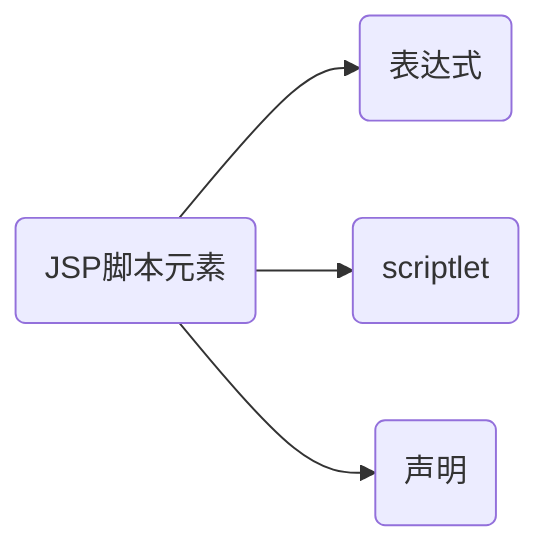

## 01JSP脚本元素

### 1.1JSP脚本元素及其组成

在JSP中嵌入的服务端（即web后端）运行的小程序称为脚本，而JSP支持的服务端脚本语言是Java，所以**这些脚本其实就是Java程序**。通常把脚本元素分为“表达式、声明、scriptlet”。

```
graph LR
A[长方形] -- 链接 --> B((圆))
A --> C(圆角长方形)
B --> D{菱形}
C --> D
```



### 1.2表达式

1. 作用：

表达式是计算java表达式的值，得到的结果转化为字符串，并在jsp页面中表达式位置进行显示。Java表达式是指由操作数（变量、常量、方法）和运算符（算术运算符、比较运算符、位移运算符）组成的且符合Java语法规则的公式。

表达式的计算在运行时进行（即JSP页面被请求时），因此在表达式中可以访问与请求有关的全部信息，其中与请求有关的信息被封装在request隐式对象中。

1. 语法格式

   > <%= Java表达式 %>

   * "<%=" 和 "%>"符号中间不能有空格。
   * 不可以插入语句。
   * 表达式必须能求值。

2. 实例：

   ```jsp
   <%@ page contentType="text/html;charset=UTF-8" language="java" %>
   <html>
     <head>
       <title>Title</title>
     </head>
     <body>
     <%=3+3%>
     </body>
   </html>
   ```

### 1.3Scriptlet

1. 作用

   Scriptlet就是在JSP页面中嵌入一段有效的Java程序段，此程序段可以是变量的声明、方法的调用。

2. 格式

   > <%= Java表达式 %>

   * "<%" 和 "%>"符号中间不能有空格。
   * "<%" 和 "%>"中除了不能定义类和方法，不能用import引入类外，可以包含任何有效的Java代码、可以定义变量、调用方法和进行各种表达式运算。
   * Scriptlet中定义的变量在当前的整个页面内都有效，但不会被其他的线程共享。

3. 实例

   ```jsp
   <%@ page contentType="text/html;charset=UTF-8" language="java" %>
   <html>
   <head>
     <title>数字逐层递加</title>
   </head>
   <body>
   <%
     for(int i = 1;i<10;i++){
       for(int j=1;j<=i;j++){
   %>
   <%=j%>
   <%
     }
   %>
   <%="</br>"%>
   <%
     }
   %>
   </body>
   </html>
   ```

   ```jsp
   <%@ page contentType="text/html;charset=UTF-8" language="java" %>
   <html>
   <head>
     <title>显示当前系统时间</title>
   </head>
   <body>
   <%
     for(int i = 1;i<10;i++){
       for(int j=1;j<=i;j++){
   %>
   <%=j%>
   <%
     }
   %>
   <%="</br>"%>
   <%
     }
   %>
   </body>
   </html>
   ```

### 1.4声明

1. 作用

   声明就是在JPS页中声明Java方法或变量等，用于定义JPS代表的Servlet类的成员变量和方法。

2. 格式

   > <%!  Java表达式  %>

   * "<%" 和 "%>"符号中间不能有空格。
   * "<%" 和 "%>"中除了不能定义类和方法，不能用import引入类外，可以包含任何有效的Java代码、可以定义变量、调用方法和进行各种表达式运算。
   * 在页面中声明的变量和方法在当前的整个页面内都有效，而且它们会被多个线程所共享。
   
3. 实例

   ```jsp
   <%@ page contentType="text/html;charset=UTF-8" language="java" %>
   <html>
   <head>
     <title>Title</title>
   </head>
   <%!
     int num = 3;
     public String sayHello(String name){
       return "Hello" + name + "!";
     }
   %>
   <body>
   <%=num%>
   <%=sayHello("Tony")%>
   </body>
   </html>
   ```

### 1.5思考

JSP声明和JSP Scriptlet的区别？

```jsp
<%@ page contentType="text/html;charset=UTF-8" language="java" %>
<html>
<head>
  <title>Title</title>
</head>
<body>
<%!
  int count1 = 1;
%>
<%
  int count2 = 2;
%>
count1==<%=count1++%><br>
count2==<%=count2++%>
</body>
</html>
```

根据页面显示效果得知count1的值每次刷新进行累加，而count2的值始终为1。原因是count1是java类的成员变量，被多个线程所共享；count2是方法的局部变量，不能被线程共享。

## 02JSP指令

2.1 概念和分类

1. 概念

   JSP指令相当于在编译期间的命令，用来设置与整个JSP页面相关的属性，它并不产生任何可见的输出，用来设置全局变量、声明类、要实现的方法和输出内容的类型等。

2. 分类

   3种，page指令、include指令、taglib指令。

   ```mermaid
   graph LR
   A:(JSP指令) --> B:(page指令)
   A: --> C:(include指令)
   A: --> D:(taglib指令)
   ```

3. 语法：

   写法一：

   > <%@ 指令名称 属性1 = "属性值1" 属性2 = "属性值2" …… 属性n = "属性值n" %>
   
   写法二：
   >  <%@ 指令名称 属性1 = "属性值1"  %>
   >  <%@ 指令名称 属性2 = "属性值2"  %>
   >  <%@ 指令名称 属性n = "属性值n"  %>

4. 说明

   属性值两边的双引号可以用单引号代替，但不能省略。如果要在属性值中使用引号，则在要在他们之前加反斜杠“\”。

### 2.2page指令

1. 概念

   page指令即页面指令，用来定义整个JSP页面的一些属性和这些属性的值。page指令可以定义MIME类型、定义需要导入的包、错误页的制定、页面编码、脚本语言等。

   * 格式一：
   * 格式二：

   **page指令**的作用对整个JSP页面有效，**与其书写位置无关**，可以放在文档中的任何地方，但通常把page指令放在JSP页面的最前面。

2. 实例

### 2.3include指令

1. 概念
2. 实例

### 2.4taglib指令

1. 概念
2. 自定义
3. 标准定义
4. 实例

