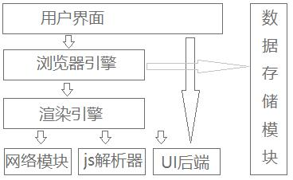

# 01 js基础概念

## 1 什么是js

1. 解释型语言，（不需要编译，边执行边解析）

为什么是解释性语言，与浏览器结构原理有关系

2. 浏览器工作原理

   

   1. 用户界面
      1. 除显示区域（显示网页的）以外的区域，如收藏夹
   2. 浏览器引擎
      1. 相当于一个中介，连接用户界面和渲染引擎
   3. 渲染引擎
      1. 显示请求过来的数据
      2. 解析html和css
      3. 显示解析的内容到屏幕上
   4. 网络模块
      1. 处理网络请求相关
   5. JavaScript解析器
      1. 用来解析和执行js代码
   6. UI后端
      1. 处理复选框，选框等复杂ui界面
   7. 数据存储模块
      1. 存储数据

## 2 js组成

1. ECMAScript（ES）
   1. ECMA是欧洲计算机制造商协会
   2. ECMAscript是ECMA制定的脚本语言标准，这样保证所有浏览器都能用，标准统一
2. DOM
   1. js操作网页上的元素
3. BOM
   1. js操作浏览器的部分功能