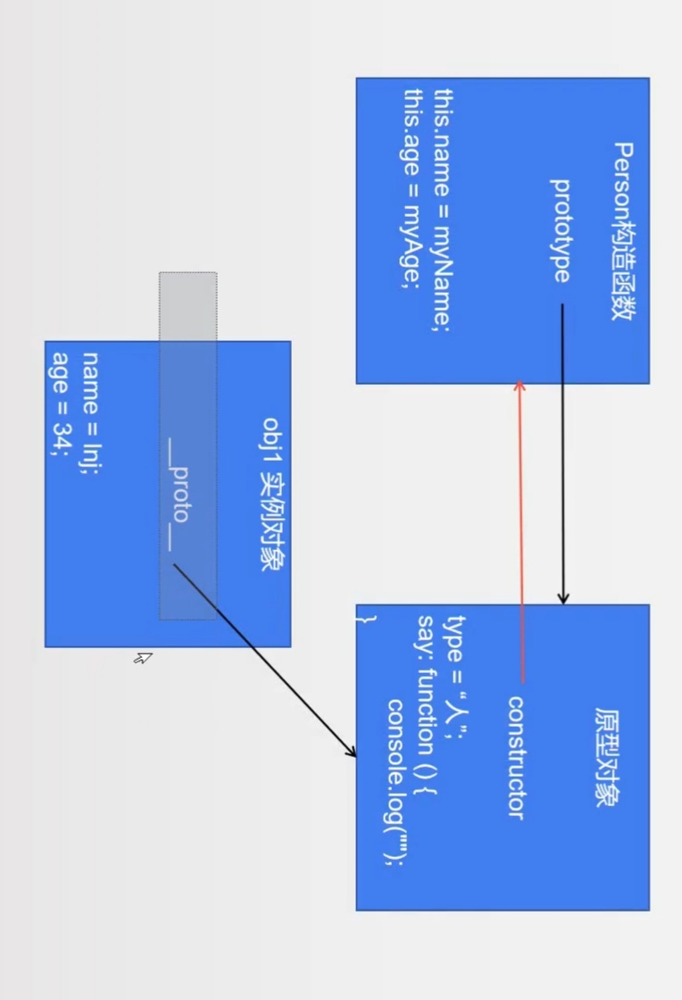
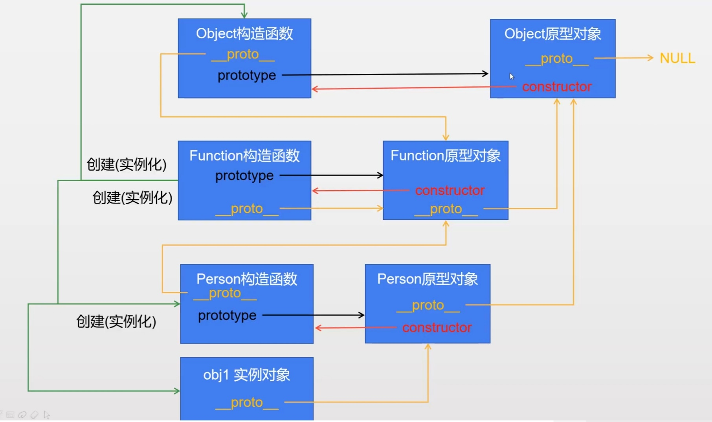

# 24 对象

## 01 创建对象

1. js中提供了一个默认的类object，我们可以通过这个类创建对象。

2. 由于我们是使用系统默认的类创建对象，所以系统不知道我们想要什么属性和行为，所以我们要手动添加属性和行为。

3. 如何添加属性

   对象名.属性名 = 值

4. 如何添加行为

   对象名.行为名称 = 函数

5. 创建对象的方法一

   ```javascript
   let obj = new Object();
   obj.name = 'zs';
   obj.age = 33;
   obj.say = function{
   	console.log('hello');
   }
   
   console.log(obj.name);
   console.log(obj.age);
   obj.say();
   ```

6. 创建对象的方法二

   ```javascript
   let obj = {}; //let obj = new Object();
   obj.name = 'zs';
   obj.age = 33;
   obj.say = function{
   	console.log('hello');
   }
   
   console.log(obj.name);
   console.log(obj.age);
   obj.say();
   ```

7. 创建对象的方法三

   *属性和属性之间用逗号隔开，属性和值之间用冒号隔开。*

   ```javascript
   let obj = {
   	name: '张三',
   	age: 33,
   	say: function(){
   		console.log('hello');
   	}
   }
   
   console.log(obj.name);
   console.log(obj.age);
   obj.say();
   ```

   

## 02 函数和方法

1. 函数就是没有和其他的类显示的绑定在一起的，我们称之为函数（面向过程，可以直接调用）。

   ```javascript
   function demo(){
   	console.log('hello');
   }
   demo();
   ```

   

2. 方法就是显示的和其它的类绑定在一起的，我们称之为方法（面向对象，需要对象名点方法名调用）。

   ```javascript
   let obj = {
   	name: '张三',
   	age: 33,
   	say: function(){
   		console.log('hello');
   	}
   }
   obj.say();
   ```

3. 区别：

   1. 函数可以直接调用，方法只能通过对象来调用。
   2. 函数内部的this输出的是window，方法内部的this输出的是当前调用的那个对象。
   
4. 静态属性和静态方法见025 面向对象三大特性。


## 03 this

1. **箭头函数this与此不同**，详情见下。
2. 无论函数还是方法，内部都有一个叫this的东东。
3. 谁调用了当前的函数或者方法，那么当前的this就是谁。
4. 函数内部的this输出的是window，方法内部的this输出的是当前调用的那个对象。

```javascript
//函数
function demo(){
	console.log(this);//window
}
demo();//其实就是window.domo();
window.domo();
```

```javascript
//方法
let obj = {
	name: 'zs',
	test: function(){
		console.log(this);
	}
}

obj.test();//对象obj {name: "zs", test: ƒ}
```

箭头函数中的this很复杂，视频也讲的模棱两可。如下，一个this两个值。

视频说此时要想开启一个新作用域必须是通过定义函数。箭头函数的指向是父作用域中的this。

我想：其实这么说也是对的。父作用域（父函数被谁调用），父作用域的this就指向谁。里面定义的箭头函数就指向谁。用更通俗的一句话说，**箭头函数的父函数被谁调用，父函数的this就指向谁，箭头函数中的this就指向谁。**而且**bind call apply无法改变箭头函数中的this指向**。**如果箭头函数被当作参数传递，那么就看箭头函数被定义的位置，在哪定义，他的父函数就是谁，而不是在哪执行父函数是谁。**

```js
let obj = {
    bar: function () {
        let x = () => console.log(this);
        return x;
    }
}

let fn1 = obj.bar();//x
fn1()//x()//bar


let fn2 = obj.bar;//bar
let fn3 = fn2();//x
fn3();//x()//window
```

```js
//如果箭头函数被当作参数传递，那么就看箭头函数被定义的位置，在哪定义，他的父函数就是谁，而不是在哪执行父函数是谁
let obj = {
    fn1: function (fn) {
        fn();
        let x = ()=>console.log(this);
        console.log("-------------");
        x();
    }
}


let obj2 = {
    fn2: function () {
        let xx = ()=>console.log(this);
        obj.fn1(xx);
    }
}

obj2.fn2();
/*
输出结果：
obj2{fn2: ƒ}  //函数xx输出，父函数是fn2，父函数调用者是obj2，但箭头函数并不在父函数中执行，父函数fn2中将箭头函数传递到fn1中执行，fn1的调用者是obj。
-------------
obj{fn1: ƒ} //函数x输出，父函数是fn1，父函数调用者是boj
*/
```

## 04 工厂函数

工厂函数就是专门用来创建对象的函数。

```javascript
function createPerson(myName, myAge){
	let obj = {},
	obj.name = myName,
	obj.age = myAge,
	obj.say = function(){
		console.log('hello');
	}
	return obj;
}

let obj1 = createPerson('zs', 33);
let obj1 = createPerson('ls', 44);
console.log(obj1);
console.log(obj2);
```

## 05 构造函数

工厂函数虽能创建对象，但显得不专业。

1. 构造函数和工厂函数一样，都是专门用于创建对象的。

2. 构造函数本质上是工厂函数的简写。

3. 构造函数与工厂函数的区别：

   1. 构造函数的**函数名称首字母必须大写**。
   2. 构造函数只能够通过new来调用。

   ```javascript
   function Person(myName, myAge){
   	this.name = myName,
   	this.age = myAge,
   	this.say = function(){
   		console.log('hello');
   	}
   }
   
   let obj1 = new Person('zs', 33);
   let obj2 = new Person('ls', 44);
   
   //与工厂函数相比，相当于
   function Person(myName, myAge){
   	//let obj = new Object();系统自动添加
   	//let this = obj;系统自动添加
   	this.name = myName,
   	this.age = myAge,
   	this.say = function(){
   		console.log('hello');
   	}
   	//return this;系统自动添加
   }
   ```

4. 当我们new Person();时系统做了什么？

   1. 会在构造函数中创建一个对象。
   2. 会自动将刚才创建的对象赋值给this。
   3. 会在构造函数的最后自动添加return this。

## 06 优化的构造函数

其实这是一个构造函数的优化过程，**此标题下全是半成品，了解就行**。

1. 优化半成品1（既然是半成品，了解就行，不要记忆）：

   ```javascript
   /*
   上面的构造函数调用obj1.say()与调用的obj2.say()是同一块内存下的say()函数吗？
   显然不是。
   
   首先，从理解的角度，我们知道工厂函数中第一句就是创建一个对象，并且把新创建的对象赋值给obj1和obj2，也就是说相当于创建了两个对象，每个对象创建了一次say()函数。这两者本就是截然不同的东西。而构造函数其实本质上也是工厂函数，都是一样的。
   
   其次，我们可以通过obj1.say === obj2.say判断。===判断如果相等，代表着两个函数内容相同，且存储在同一块内存。显然输出的是false。
   
   那么问题来了，这样同一个函数相当于复制了很多遍，岂不是浪费性能
   */
   //优化开始
   function mySay(){
   	console.log(666);
   }
   
   function Person(myName, myAge){
   	this.name = myName,
   	this.age = myAge,
   	this.say = mySay;
   }
   
   let obj1 = new Person('zs', 33);
   let obj2 = new Person('ls', 44);
   obj1.say === obj2.say; //true
   //优化成功
   
   ```

2. 优化半成品2（既然是半成品，了解就行，不要记忆）

   ```javascript
   /*
   	上述方法，虽不太占用内存了，但是方法定义在全局之中，浪费了一个全局名字，而且看着也好像跟构造方法无关，影响阅读。
   //1. 阅读性降低了
   //2. 污染了全局的命名空间
   */
   
   //解决：把方法放在一个对象里。
   let fns = {
   	mySay: function (){
   		console.log(666);
   	}
   }
   
   function Person(myName, myAge){
   	this.name = myName,
   	this.age = myAge,
   	this.say = fns.mySay;
   }
   
   let obj1 = new Person('zs', 33);
   let obj2 = new Person('ls', 44);
   obj1.say === obj2.say; //true
   ```

3. 优化半成品3

   ```javascript
   //上面的仍然不专业
   Person.prototype = {
   	mySay: function (){
   		console.log(666);
   	}
   }
   function Person(myName, myAge){
   	this.name = myName,
   	this.age = myAge;
   }
   let obj1 = new Person('zs', 33);
   let obj2 = new Person('ls', 44);
   obj1.say === obj2.say; //true
   ```


## 07 prototype特点

1. 存储在prototype中的方法可以被对应改造函数创建的所有对象共享。

2. prototype中除了可以存储方法以外，还可以存储属性。

3. prototype如果出现了和构造函数中同名的属性或者方法，对象在访问的时候访问到的是构造函数中的数据。

4. prototype中一般情况下用于存储所有对象都相同的一些属性（比如种类：人）以及方法（比如说固定的语句）

5. 如果是对象特有的属性（比如每个人的姓名都不同）或者方法，我们会存储到构造函数中。

6. 每个”构造函数“中都有一个默认属性，叫做prototype，prototype属性保存着一个对象（或者说prototype就是一个对象），这个对象我们称之为”原型对象“。

7. 每个原型对象中都有一个默认的属性，叫做constructor，**constructor**指向当前原型对象对应的那个构造函数。

8. 通过构造函数创建出来的对象我们称之为”实例对象“，每个实例对象中都有一个默认的属性，叫做`__proto__`，`__proto__`指向创建它的那个构造函数的原型对象。

   ```javascript
   console.log(Person.prototype);
   console.log(Person.prototype.constructor);
   console.log(Person.prototype.constructor === Person);//true
   
   console.log(per1.prototype);
   console.log(per1.constructor);
console.log(per1.__proto__);
   console.log(per1.__proto__ === Person.prototype);//true
   ```
   
   


##    08 Function函数

1. js中函数是引用类型（对象类型），既然是对象。所以也是通过构造函数创建出来的，“所有函数”都是通过Function构造函数创建出来的对象。

2. js中只要是“函数”就有prototype属性，“Function函数的”prototype属性指向“Function原型对象“。

   ```javascript
   console.log(Function.prototype);
   console.log(Function.protptype.constructor);
   ```

   

3. js中只要”原型对象“就有constructor属性，”Function原型对象“的constructor指向它对应的构造函数。

   ```javascript
   console.log(Function.protptype.constructor === Function);//true
   ```

4. js中万物皆对象，只要是对象就有`__proto__`属性。

   ```javascript
   console.log(Person.__proto__ === Function.prototype);//true
   ```

## 09 Object函数

首字母大写，说明也是一个构造函数。

```javascript
conselo.log(Object);
conselo.log(Object.__proto__ === Function.prototype);//type

```

想要解释清楚，真是废话没少说，重点没说中，怎么办？放弃了，直接上图，图要是看不懂，我还有一个链接，上面解释的比较详细。[点击](https://blog.csdn.net/cc18868876837/article/details/81211729)



## 10 优化后的构造函数

叙述了一堆，只为加一句`constructor: Person,`使其指向正确，因为不写的化就破坏了原本的结构。

```javascript
Person.prototype = {
	constructor: Person,
	mySay: function (){
		console.log(666);
	}
}
function Person(myName, myAge){
	this.name = myName,
	this.age = myAge;
}
let obj1 = new Person('zs', 33);
let obj2 = new Person('ls', 44);
obj1.say === obj2.say; //true
```


## 11 原型链

1. 实例对象查找方法与属性会先查找自己有没有，自己没有查找构造自己的构造函数的原型对象有没有，还没有就找Object的原型对象(指向null)有没有，还没有就报错。全程沿着原型链找。

2. 原型对象中有与自己相同的属性，则用自己的，相当于就近原则。

3. 自己没有某个属性，但原型对象中有，就会使用原型对象中的。

4. 再给一个对象设置属性时不会在(父)构造函数的原型对象中设置，即使该对象原来没有该属性，而原型对象中有，也不会修改原型对象中的，而是自己新增一个同名的属性。代码如下：

   ```javascript
       function Person(myName, myAge) {
           this.name = myName;
           this.age = myAge;
       }
       Person.prototype = {
           sex: 'f',
           say: function() {
               console.log(222);
           }
       }
       let obj1 = new Person('inj', 34);
       // console.log(Person.prototype.constructor);
       console.log(obj1.sex);//f 实例对象中没有，访问的是父构造函数的原型对象
       console.log(Person.prototype.sex);//f  父构造函数的原型对象中
       console.log(obj1.__proto__.sex);//f  父构造函数的原型对象中
       console.log('--------');
       obj1.sex = 'm';//实例对象中没有，添加在实例对象中，而不是修改父构造函数的原型对象
       console.log(obj1.sex);//m
       console.log(Person.prototype.sex);//f  父构造函数的原型对象中
       console.log(obj1.__proto__.sex);//f  父构造函数的原型对象中
   ```

   

