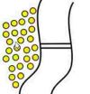
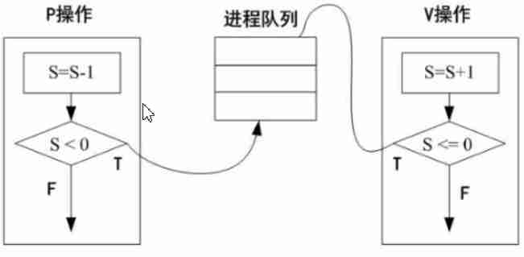
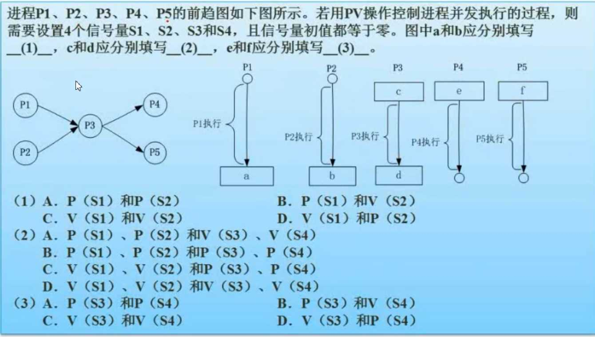

## 1 进程管理

1 进程管理

### 1.1 进程的状态

最之前，进程状态有3种，运行，就绪和等待。运行就是不缺任何资源在运行；就绪就是一切资源都准备好了，只缺CPU资源，万事俱备只欠东风；等待就是除了CPU其他资源也还没准备好。

后来，由于发现还有正在运行状态的，但是人想停止他，比如来电话时想停止电脑正在播放的音乐，那么三态就不够用了，出来了一个五态，**五态比三态多静止就绪和静止阻塞两种状态。**

静止就绪就是人为停掉占用的CPU资源（这个动作称为挂起），但由于其他资源仍然是准备好的，只需激活就可直接变为就绪状态排队等待。静止阻塞类似。

### 1.2 前驱图

1.2 前驱图

比如过年包饺子：

A：绞肉

B：切葱末

C：切姜末

D：搅拌

E：包饺子

单人完成：① → ② → ③ → ④ → ⑤

事实上可以由多人同时完成：

① ↘

② →   > → ④ → ⑤

③ ↗

以上便是前驱图

### 1.3 PV操作

1.3 PV操作

在此之前，先了解一下同步与互斥

互斥：千军万马过独木桥。

同步：骑自行车的快，需等待步行的。

注意点：

同步与互斥并不互为反义，同步的反义是异步，互斥的反义是共享。

市场中的同步与互斥举例

下面说PV操作

概念

临界资源：诸进程间需要互斥方式对其进行共享的资源，如打印机，磁带机，独木桥，是共享的又是互斥的。

临界区：每个进程中访问临界资源的那段代码称为临界区。

信号量：是一种特殊变量。P(S)中的s就是信号量。

---

例子：可以分析下试试

    
生产者：

    
生产一个产品；

    
P(S1);

    
送产品到缓冲区;

    
V(S2);

    

    
生产者：

    
生产一个产品；

    
P(S1);

    
送产品到缓冲区;

    
V(S2);

    S1初值为1，S2初值为0

例题：

		

			某书店有一个收银员，该书店最多允许n个购书者进入。将收银员和购书者看做不同的进程，其工作流程如下图所示。利用PV操作实现该进程，设置信号量S1、S2和Sn，初值分别为0，0，n。则图中a1和a2应填入_(1)_，图中b1和b2应为_(2)_。

			<!--中间-->
			

				<!--zhongzuo-->
				

					
购书者进程i(i=1,2,…,n)

					
↓

					
进入

					
P(Sn)

					
↓

					
购书

					
↓

					
付款

					
a1

					
a2

					
↓

					
V(Sn)

					
离开书店

					
↓

				

				<!--zhongyou-->
				

					
收银员进程

					
↓

					
b1

					
↓

					
收费

					
↓

					
b2

					
↓

					
返回至收银员进程下

				

			

			<!--下面-->
			

				

					
(1)

					
A.&nbsp;V(S1)、P(S2)

					
B.&nbsp;V(Sn)、P(Sn)

					
C.&nbsp;P(S1)、V(S2)

					
D.&nbsp;P(S2)、V(S1)

					
(2)

					
A.&nbsp;P(Sn)、V(S2)

					
B.&nbsp;V(Sn)、P(S2)

					
C.&nbsp;P(S1)、V(S2)

					
D.&nbsp;P(S2)、V(S1)

				

			

			
答案：A、C

		

个人理解：执行一次V，才能执行一次P。相当于解锁与加锁。

答案：C、A、A

### 1.4 死锁问题

进程管理是操作系统的核心，但如果设计不当，就会出现死锁问题。如果一个进程等待一件不可能的事，则进程就死锁了。而如果一个或多个进程产生死锁，就会造成系统死锁。

例：系统有三个进程：A、B、C。这三个进程都需要5个系统资源。如果系统至少有多少个资源，则不可能发生死锁？

进程A、B、C都各需要5个资源，如果都给他们分配4个资源，那么由于没有一个进程能完成任务，就会死锁。如果此时再加一个资源，无论分配给谁，那么那个被分配者都会完成任务，其他进程也相继会完成任务。所以至少要有3*4+1 = 13个资源。

公式（可以不记）就是 

>  进程数 * ( 需要资源数n - 1 ) +1

### 1.5 银行家算法

死锁之因，无非有四：

1. 互斥：进程间不共享资源，执行A就不能执行B。
2. 保持和等待：占用了资源，由于资源不够不能执行，保持等待，但依然占用资源。
3. 不剥夺：计算机不剥夺别的资源。
4. 环路等待：

只要打破这些，想办法至少满足其一便可破解死锁。

但是，我们不讲这些，我们只谈死锁的避免之银行家算法。

银行家算法：分配资源的原则

1. 当一个进程对资源最大需求量不超过系统中的资源数时可以接纳该进程。
2. 进程可以分期请求资源，但请求的总数不能超过最大需求量。
3. 当系统现有的资源不能满足进程尚需资源数时，对进程的请求可以推迟分配，但总能使进程在有限的时间里得到资源。

说白了就是分配出去资源，你得确保能完成任务，然后让我收回资源。

***

例一：

假设系统中有三类互斥资源R1、 R2、 R3，可用资源数分别是9、8、5。在T0时刻系统中有P1、P2、P3、P4和P5五个进程，这些进程对资源最大需求量和已分配资源数如下所示，如果进程按<u>     1</u>序列执行，那么系统状态是最安全的。

A P2 -> P4 -> P5 -> P1 -> P3 

## 2 存储管理

2 存储管理

某计算机系统的内存大小为128K，采用可变分区分配方式进行内存分配，当前系统的内存分块情况如下图所示，现在作业4申请内存9K，几种不同的存储分配算法在分配中，会产生什么结果？

分配前

	

		
作业1(33K)

		
25k

		
作业2(22K)

		
作业3(10K)

		
28k

		
10k

	

首次适应法

	

		
作业1(33K)

		
作业4(9K)

		
16k

		
作业2(22K)

		
作业3(10K)

		
28k

		
10k

	

最佳适应法

	

		
作业1(33K)

		
25k

		
作业2(22K)

		
作业3(10K)

		
28k

		
作业4(9K)

		

	

最差适应法

	

		
作业1(33K)

		
25k

		
作业2(22K)

		
作业3(10K)

		
作业4(9K)

		
19k

		
10k

	

循环首次适应法

	

		
作业1(33K)

		
25k

		
作业2(22K)

		
作业3(10K)

		
作业4(9K)

		
19k

		
10k

	

首次适应法，就是依次将剩余的空间依次从上到下顺序扫描，发现有可用的空间就进行存放。

最佳适应法，就是把所有空闲空间按从小到大顺序排列，逐个扫描，发现大小合适，就进行存放。

最差适应法，把空闲空间按从大到小顺序排列，发现大小可用，就进行存放。因为最佳适应法时间长了会产生大量极小空闲空间，所以才有最差适应法。

循环首次适应，就是从上到下依次扫描，如果上次放的是在25k空间中，这次就放在28k空间中，下次放在10空间中。这样避免了，之对某一块空间进行反复存储。

段页式存储

段页式存储

页面置换算法

## 3 文件管理
3 文件管理
索引文件

位示图

位示图

## 4 作业管理
## 5 设备管理
## 6 微内核操作系统

虚设备与SPOOLING技术

## 注：
1.标红的为重要

