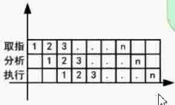
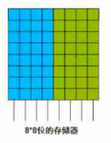
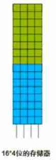
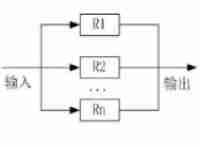
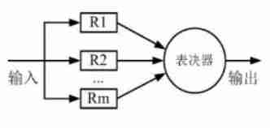
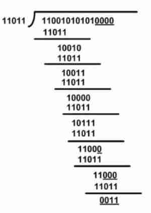

## 1 数据的表示

### 1.1 R进制转十进制

R进制转十进制使用按权展开法，其具体操作方式是：将R进制数的每一位数值用R<sup>k</sup>形式表示，即幂的底数是R指数为k。

例如二进制 10100.01 = 1×2<sup>4</sup>+1×2<sup>2</sup>+1×2<sup>-2</sup>
例如七进制 604.01 = 6×7<sup>2</sup>+4×7<sup>0</sup>+1×7<sup>-2</sup>

### 1.2 十进制转R进制

十进制转R进制使用短除法

2 <u>| 94</u>	余 0

2 <u>| 47</u>		 1

2 <u>| 23</u>		 1

2 <u>| 11</u>		 1

2 <u>| 5</u>		  1

2 <u>| 2</u>		  0

2 <u>| 1</u>		 1

​	 <u>0</u>		 

结果为1011110

### 1.3 二八十六

二进制转八进制与十六进制

```
二进制转八进制
10 001 110 三三一组（二进制数）
2   1   6	（八进制数）
-------------------------
二进制转十六进制
1000 1110 四四一组（二进制数）
  8	   E	（十六进制数）
```

### 1.4 原反补移码

|      | 数值1     | 数值-1    | 1-1       |
| ---- | --------- | --------- | --------- |
| 原码 | 0000 0001 | 1000 0001 | 1000 0010 |
| 反码 | 0000 0001 | 1111 1110 | 1111 1111 |
| 补码 | 0000 0001 | 1111 1111 | 0000 0000 |
| 移码 | 1000 0001 | 0111 1111 | 1000 0000 |

求法：

|      | 正数         | 负数                         |
| ---- | ------------ | ---------------------------- |
| 原码 | 原反补相同   |                              |
| 反码 | 原反补相同   | 符号位不动，后面所有位取反。 |
| 补码 | 原反补相同   | 反码末位加1                  |
| 移码 | 补码首位取反 | 补码首位取反                 |

数值表示范围

|      | 整数                                     |
| ---- | ---------------------------------------- |
| 原码 | -(2<sup>n-1</sup>-1) ~ 2<sup>n-1</sup>-1 |
| 反码 | -(2<sup>n-1</sup>-1) ~ 2<sup>n-1</sup>-1 |
| 补码 | -2<sup>n-1</sup> ~ 2<sup>n-1</sup>-1     |

### 1.5 浮点数运算 

N = M × R<sup>e</sup>

其中M称为尾数，e是指数，R为基数

过程：对阶(低次化高次) => (尾数计算) => 结果格式化(个位数大于0小于10)

## 2 计算机结构

<div style="width: 200px; height: 200px; border: 2px solid red ; margin:0 auto">
	<div style="width: 180px; height: 100px; border: 2px solid red ;margin: 0 auto;margin-top:5px;">
	<div style="width: 190px;height: 40px; text-align: center;line-height: 40px;">CPU</div>
		<div style="width: 88px; height: 50px; line-height: 50px; text-align: center; float: left; border: 1px solid yellow;background-color: green">运算器</div>
		<div style="width: 88px; height: 50px; line-height: 50px; text-align: center; float: right; border: 1px solid yellow;background-color: green">控制器</div>
	</div>
	<div style="width: 180px; height: 40px; text-align: center; line-height: 40px; background-color: green; margin: 0 auto;margin-top: 12px;">
	主存储器
	</div>
	<div style="width: 180px; height: 40px; text-align: center; line-height: 40px; margin: 0 auto;">
	主机
	</div>
</div>

运算器：

1. 算术逻辑单元
2. 累加寄存器AC
3. 数据缓冲寄存器DR
4. 状态条件寄存器RSW

控制器：

1. 程序计数器
2. 指令寄存器
3. 指令译码器
4. 时序部件

## 3 Flynn分类法

| 体系结构类型         | 结构                                                     | 关键特性                               | 代表                                         |
| -------------------- | -------------------------------------------------------- | -------------------------------------- | -------------------------------------------- |
| 单指令流单数据流SISD | 控制部分：一个<br/>处  理  器：一个<br/>主存模块：一个   |                                        | 单处理器系统                                 |
| 单指令流多数据流SIMD | 控制部分：一个<br/>处  理  器：多个个<br/>主存模块：多个 | 各处理器以异步的形式执行同一条命令     | 阵列处理机<br/>并行处理机<br/>超级向量处理机 |
| 多指令流单数据流MISD | 控制部分：多个<br/>处  理  器：一个<br/>主存模块：多个个 | 被证明不可能，至少是不实际             | 目前没有，有文献称流水线计算机为此类         |
| 多指令流多数据流MIMD | 控制部分：多个<br/>处  理  器：多个<br/>主存模块：多个   | 能够实现作业、任务、指令等各级全面并行 | 多处理机系统<br/>多计算机                    |

## 4 CISC与RISC

考察形式多下面哪一个是对（或错的），哪一种特点是（或不是）RISC（或CISC）的特点；

| 指令系统类型 | 指令                                                         | 寻址方式   | 实现方式                                             | 其他                       |
| ------------ | ------------------------------------------------------------ | ---------- | ---------------------------------------------------- | -------------------------- |
| CISC         | 数量多，使用频率差别大，可变长格式                           | 支持多种   | 微程序控制技术（微码）                               | 研制周期长                 |
| RISC         | 数量少，使用频率接近，定长格式，大部分为单周期指令，操作寄存器，只有Load/Store操作内存 | 支持方式少 | 增加了通用寄存器，硬布线逻辑控制为主；适合采用流水线 | 优化编译，有效支持高级语言 |


## 5 流水线技术

### 5.1 流水线计算



> * 流水线周期为执行时间最长的一段
>
> * 流水线计算公式：
>
> 理论公式 -- 1条指令执行时间+（指令条数-1）*流水线周期
>
> 实践公式 -- (k+n-1)*△t
>
>  -----k是分成了3段，n是多少指令

	例：若指令流水线把一条指令分为取指、分析和执行三部分，且三部分分别
	是取指2ns，分析2ns，执行1ns。那么，流水线周期是多少？100条指令全
	部执行完毕需要的时间是多少？
	1. 2ns
	2. (2+2+1)+(100-1)*2 = 203 理论
	2. (3+100-1)*2 = 204	实践
	流水线吞吐率：100/203
	加速比计算：(2+2+1)*100 = 50 --不使用流水线所用时间
		500/203=

### 5.2 流水线吞吐率计算

	流水线吞吐率是指在单位时间内流水线所完成的任务数量或输出的结果数量。

<div id="write" class="is-node"><div contenteditable="false" spellcheck="false" class="mathjax-block md-end-block md-math-block md-rawblock" id="mathjax-n22" cid="n22" mdtype="math_block"><div class="md-rawblock-container md-math-container" contenteditable="false" tabindex="-1"><div class="MathJax_SVG_Display" style="text-align: center;"><span class="MathJax_SVG" id="MathJax-Element-22-Frame" tabindex="-1" style="font-size: 100%; display: inline-block;"><svg xmlns:xlink="http://www.w3.org/1999/xlink" width="21.313ex" height="6.759ex" viewBox="0 -1724.2 9176.3 2910.2" role="img" focusable="false" style="vertical-align: -2.755ex; max-width: 100%;"><defs><path stroke-width="0" id="E26-MJMATHI-54" d="M40 437Q21 437 21 445Q21 450 37 501T71 602L88 651Q93 669 101 677H569H659Q691 677 697 676T704 667Q704 661 687 553T668 444Q668 437 649 437Q640 437 637 437T631 442L629 445Q629 451 635 490T641 551Q641 586 628 604T573 629Q568 630 515 631Q469 631 457 630T439 622Q438 621 368 343T298 60Q298 48 386 46Q418 46 427 45T436 36Q436 31 433 22Q429 4 424 1L422 0Q419 0 415 0Q410 0 363 1T228 2Q99 2 64 0H49Q43 6 43 9T45 27Q49 40 55 46H83H94Q174 46 189 55Q190 56 191 56Q196 59 201 76T241 233Q258 301 269 344Q339 619 339 625Q339 630 310 630H279Q212 630 191 624Q146 614 121 583T67 467Q60 445 57 441T43 437H40Z"></path><path stroke-width="0" id="E26-MJMATHI-50" d="M287 628Q287 635 230 637Q206 637 199 638T192 648Q192 649 194 659Q200 679 203 681T397 683Q587 682 600 680Q664 669 707 631T751 530Q751 453 685 389Q616 321 507 303Q500 302 402 301H307L277 182Q247 66 247 59Q247 55 248 54T255 50T272 48T305 46H336Q342 37 342 35Q342 19 335 5Q330 0 319 0Q316 0 282 1T182 2Q120 2 87 2T51 1Q33 1 33 11Q33 13 36 25Q40 41 44 43T67 46Q94 46 127 49Q141 52 146 61Q149 65 218 339T287 628ZM645 554Q645 567 643 575T634 597T609 619T560 635Q553 636 480 637Q463 637 445 637T416 636T404 636Q391 635 386 627Q384 621 367 550T332 412T314 344Q314 342 395 342H407H430Q542 342 590 392Q617 419 631 471T645 554Z"></path><path stroke-width="0" id="E26-MJMAIN-3D" d="M56 347Q56 360 70 367H707Q722 359 722 347Q722 336 708 328L390 327H72Q56 332 56 347ZM56 153Q56 168 72 173H708Q722 163 722 153Q722 140 707 133H70Q56 140 56 153Z"></path></defs><g stroke="currentColor" fill="currentColor" stroke-width="0" transform="matrix(1 0 0 -1 0 0)"><use xlink:href="#E26-MJMATHI-54" x="0" y="0"></use><use xlink:href="#E26-MJMATHI-50" x="704" y="0"></use><use xlink:href="#E26-MJMAIN-3D" x="1732" y="0"></use><g transform="translate(2510,0)"><g transform="translate(397,0)"><rect stroke="none" width="6147" height="60" x="0" y="220"></rect><g transform="translate(1351,714)"><text font-family="STIXGeneral,'Arial Unicode MS',serif" stroke="none" transform="scale(53.819) matrix(1 0 0 -1 0 0)">指</text><g transform="translate(861,0)"><text font-family="STIXGeneral,'Arial Unicode MS',serif" stroke="none" transform="scale(53.819) matrix(1 0 0 -1 0 0)">令</text></g><g transform="translate(1722,0)"><text font-family="STIXGeneral,'Arial Unicode MS',serif" stroke="none" transform="scale(53.819) matrix(1 0 0 -1 0 0)">条</text></g><g transform="translate(2583,0)"><text font-family="STIXGeneral,'Arial Unicode MS',serif" stroke="none" transform="scale(53.819) matrix(1 0 0 -1 0 0)">数</text></g></g><g transform="translate(60,-883)"><text font-family="STIXGeneral,'Arial Unicode MS',serif" stroke="none" transform="scale(53.819) matrix(1 0 0 -1 0 0)">流</text><g transform="translate(861,0)"><text font-family="STIXGeneral,'Arial Unicode MS',serif" stroke="none" transform="scale(53.819) matrix(1 0 0 -1 0 0)">水</text></g><g transform="translate(1722,0)"><text font-family="STIXGeneral,'Arial Unicode MS',serif" stroke="none" transform="scale(53.819) matrix(1 0 0 -1 0 0)">线</text></g><g transform="translate(2583,0)"><text font-family="STIXGeneral,'Arial Unicode MS',serif" stroke="none" transform="scale(53.819) matrix(1 0 0 -1 0 0)">执</text></g><g transform="translate(3444,0)"><text font-family="STIXGeneral,'Arial Unicode MS',serif" stroke="none" transform="scale(53.819) matrix(1 0 0 -1 0 0)">行</text></g><g transform="translate(4305,0)"><text font-family="STIXGeneral,'Arial Unicode MS',serif" stroke="none" transform="scale(53.819) matrix(1 0 0 -1 0 0)">时</text></g><g transform="translate(5166,0)"><text font-family="STIXGeneral,'Arial Unicode MS',serif" stroke="none" transform="scale(53.819) matrix(1 0 0 -1 0 0)">间</text></g></g></g></g></g></svg></span></div></div></div><p>&nbsp;</p></div>


> 计算方式2： 1/△t 即：一条指令/周期

### 5.3 流水线加速比计算

	完成同样一批任务，
	不使用流水线所用的时间与
	使用流水线所用的时间之比
	称为流水线的加速比。


### 5.4 流水线的效率

	定义：流水线的效率是指流水线设备的利用率。
	在时空图上，流水线的效率定义为n个任务占用的时空区
	与k个流水段总的时空区之比。


例题：求效率？


	任务所占时空区(△t+△t+△t+3△t)*4
	总时空区 15△t*4
	①/②即答案

## 6 存储系统

### 6.1 层次化存储结构

由慢到快：

外存(硬盘、U盘、光盘) --> 内存（又称主存） --> Cache(按内容存取)---> CPU(寄存器)

### 6.2 Cache概念

	Cache功能：提高CPU数据输入输出的速率，
		突破冯·诺依曼瓶颈，即CPU与存储系
		统间数据传送带宽限制。
	在计算机的存储系统体系中，Cache是访问
		速度最快的层次。
	使用Catche改善系统性能的依据是程序的
		局部性原理。


	如果以h代表Cache的访问民众率(访问cache，
	cache中恰好有需要找的东西叫命中率)，t1表示
	Cache的周期时间，t2表示主存储器周期时间，
	以读操作为例，使用“Cache+主存储器”的系统
	平均周期为t3，则：
		t3 = h × t1 + (1-h) × t2
	其中，(1-h)又称失败率（未命中率）

>例：cache访问命中率为95%，访问cache周期时间t1是1ns，访问主存储器周期t2是1ms=1000ns。则：
>
>使用“cache+主存储器”的系统平均周期
>
>t3 = 1ns * 95% + （1-95%）*1000ns=50.95ns
>
>比不使用cache的1000ns快了20倍

### 6.3 局部性原理

	* 时间局部性(以下面代码为例)
	* 空间局部性(以初始化一个数组为例)
	* 工作集原理：工作集是进程运行时被频繁访问的页面集合。

```c
int i,s = 0;
for(i=1;i<1000;i++)
	for(j=1;j<1000;j++)
	s+=j;
printf("结果为:%d,s");
```

### 6.4 主存-分类和编址

随机存储器（RAM）只要一断电，自动消掉。

只读存储器（ROM），断点也能保存住。


<span></span><span></span><span></span>

	例：内存地址从AC000H到C7FFFH，共有__(1)__K
	个地址单元，如果该内存地址按字(16bit)编制，由
	28片存储器芯片构成。已知构成此内存的芯片每片有
	16K个存储单元，则该芯片每个存储单元__(2)__位。
	(1)	A.96	B.112	C.132	D.156
	(2) A.4		B.8 	C.16	D.24
	答：
	1. 计算多少k，应C7FFF +1 - AC000 = 1C000
		注意借一当十六。最后化为K，1c000/2的10次方
		得112K.
	2. (112K*16)/(28*16K*xx) = 1 解得xx = 4 
	B、A

### 6.5 磁盘结构与参数


	存取时间 = 寻道时间 + 等待时间(平均定位时间+转动延迟)
	注意点：
		寻道时间是指磁头移动到磁道所需的时间，等待时间是等待
		读写的扇区转到磁头下方所用的时间

---

例题：假设某磁盘的每个磁道划分成11个物理块，每块存放1个逻辑记录。逻辑记录R<sub>0</sub>,R<sub>1</sub>……R<sub>9</sub>,R<sub>10</sub>,记录存放顺序如下表：

| 物理块   | 1             | 2             | 3             | 4             | 5             | 6             | 7             | 8             | 9             | 10            | 11             |
| -------- | ------------- | ------------- | ------------- | ------------- | ------------- | ------------- | ------------- | ------------- | ------------- | ------------- | -------------- |
| 逻辑记录 | R<sub>0</sub> | R<sub>1</sub> | R<sub>2</sub> | R<sub>3</sub> | R<sub>4</sub> | R<sub>5</sub> | R<sub>6</sub> | R<sub>7</sub> | R<sub>8</sub> | R<sub>9</sub> | R1<sub>0</sub> |

如果磁盘的旋转周期为33ms，磁头当前处在R<sub>0</sub>的开始处。若系统使用单缓冲区顺序处理这些记录，每个记录处理时间为3ms，则处理这11个记录最长时间为(48);若对信息存储进行优化分布后，处理11个记录的最少时间为(49).

(48)	A. 33ms		B. 336ms		C. 366ms		D. 376ms

(49)	A.33ms		B. 66ms		C. 86ms		D. 93ms

分析：


时间应为（33+3）*10 + 3 + 3  = 366ms

优化后如下如，最少时间为33*2=66ms

  

## 7 总线系统

根据总线所处位置不同，总线通常被分为三种类型，分别是：

1. 内部总线；

2. 系统总线： 
   1. 数据总线
   2. 地址总线
   3. 控制总线

3. 外部总线

## 8 可靠性

### 8.1 串联系统

只要有一个子系统不能运行，整个系统都不能运行。


	可靠性：R = R1 × R2 × …… × Rn
	失效率：
		1. 当子系统比较多，每个子系统失效率极低的时候
			失效率为 各个系统的失效率累加起来
			λ = λ1 + λ2 +……+ λn
		2. 当可以计算时，使用1-可靠性是最准确的算法，
			上面的算法只是辅助计算复杂的，是约算，不准。

### 8.2 并联系统

只要有一个子系统能运行，整个系统都能运行。



	可靠性：R = 1 - (1-R1)×(1-R2)×……×(1-Rn)
	先计算出失效率，再用1减去

### 8.3 冗余模型

几乎不考




### 8.4 串并联结合

常考


计算结果：R × (1-(1-R)<sup>3</sup>)  × (1-(1-R)<sup>2</sup>)

## 9 校验码

### 9.1 差错控制-CRC与海明码

1. 什么是检错和纠错？

   检错就是检查出错误，纠错是检查出并纠正。

2. 什么是码距？

   一个编码系统的码距是整个编码系统中任意（所有）两个码字最小的距离。

   例：

   若用一位长度的二进制编码。若A=1,B=0。这样A,B间最小的码距是1.

   若用二位长度的二进制编码。若A=11,B=00。则A,B间最小的码距是2.

   若用三位长度的二进制编码。若A=111,B=000。A,B间最小的码距是3.

3. 码距与检错、纠错有何关系？

   1. 在一个码组内为了检测e个误码，要求最小码距d应该满足：d>=e+1

   2. 在一个码组内为了纠正他t个误码，要求最小码距应该满足：

      d>=2t+1

### 9.2 循环校验码（CRC）

什么是模2除法，它和普通除法有何区别？

模2除法是指在做除法运算的过程中不计其进位的除法。

例如，10111对110进行普通除法和模2（**异或**计算）除法为：

 

---

例：原始报文为"`11001010101`",其生成多项式为："X<sup>4</sup> + X<sup>3</sup> + X + 1"。对其进行CRC编码后的结果为？

解析：

因为生成多项式n次幂对应的数字为11011，所以除以11011，因为是5个数字，所以补 5-1 个零，最终用余数代替。



所以结果为"`110010101010011`"，注意后面多了0011。

### 9.3 海明码

<span style="color:black;background-color:#00ff11">2<sup>r</sup> >= K + r + 1</span>

K：二进制的位数

r：未知数


